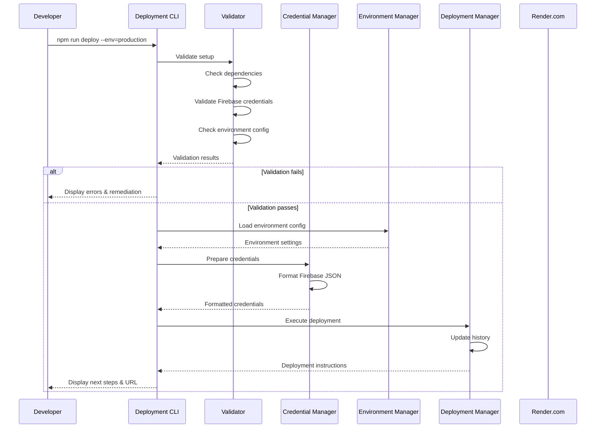

# Deployment Automation Design Document

## Overview

The deployment automation system provides a comprehensive CLI-based workflow for deploying the Trip Defender backend to Render.com. The system replaces manual deployment steps with automated scripts, validates configurations, manages environment-specific settings, and integrates with CI/CD pipelines. The design focuses on developer experience, error prevention, and deployment reliability.

## Architecture

### High-Level Architecture

```
┌─────────────────────────────────────────────────────────────┐
│                    Developer Interface                       │
│  (npm scripts: deploy, health-check, prepare-credentials)   │
└────────────────────┬────────────────────────────────────────┘
                     │
┌────────────────────▼────────────────────────────────────────┐
│                 Deployment CLI System                        │
│  ┌──────────────┐  ┌──────────────┐  ┌──────────────┐     │
│  │  Validator   │  │  Credential  │  │  Deployment  │     │
│  │   Module     │  │   Manager    │  │   Manager    │     │
│  └──────────────┘  └──────────────┘  └──────────────┘     │
│  ┌──────────────┐  ┌──────────────┐  ┌──────────────┐     │
│  │   Health     │  │  Environment │  │   History    │     │
│  │   Checker    │  │   Manager    │  │   Tracker    │     │
│  └──────────────┘  └──────────────┘  └──────────────┘     │
└────────────────────┬────────────────────────────────────────┘
                     │
┌────────────────────▼────────────────────────────────────────┐
│              Configuration & State Layer                     │
│  • deployment-config.json (environment configs)              │
│  • deployment-history.json (deployment records)              │
│  • .env files (environment variables)                        │
│  • serviceAccountKey.json (Firebase credentials)             │
└────────────────────┬────────────────────────────────────────┘
                     │
┌────────────────────▼────────────────────────────────────────┐
│                  External Services                           │
│  • Render.com API (deployment target)                        │
│  • Firebase Admin SDK (credential validation)                │
│  • GitHub Actions (CI/CD integration)                        │
└──────────────────────────────────────────────────────────────┘
```

### Component Interaction Flow



## Components and Interfaces

### 1. Validator Module

**Purpose**: Validates all prerequisites before deployment

**File**: `backend/scripts/validator.js`

**Interface**:
```javascript
class Validator {
  /**
   * Validates all deployment prerequisites
   * @param {Object} options - Validation options
   * @param {string} options.environment - Target environment
   * @param {boolean} options.skipCredentials - Skip credential validation
   * @returns {Promise<ValidationResult>}
   */
  async validateAll(options)

  /**
   * Validates Firebase service account file
   * @returns {Promise<CredentialValidation>}
   */
  async validateFirebaseCredentials()

  /**
   * Validates npm dependencies are installed
   * @returns {Promise<DependencyValidation>}
   */
  async validateDependencies()

  /**
   * Validates environment configuration
   * @param {string} environment - Environment name
   * @returns {Promise<EnvironmentValidation>}
   */
  async validateEnvironment(environment)

  /**
   * Validates backend server configuration
   * @returns {Promise<ServerValidation>}
   */
  async validateServerConfig()
}
```

**Validation Checks**:
- Firebase service account file exists and contains valid JSON
- Required fields present: `project_id`, `private_key`, `client_email`
- All npm dependencies installed (checks node_modules)
- Environment configuration file exists for target environment
- Required environment variables defined
- Server.js and critical files present
- Port configuration valid

### 2. Credential Manager

**Purpose**: Manages Firebase credentials and formatting

**File**: `backend/scripts/credential-manager.js`

**Interface**:
```javascript
class CredentialManager {
  /**
   * Prepares Firebase credentials for Render deployment
   * @returns {Promise<PreparedCredentials>}
   */
  async prepareCredentials()

  /**
   * Formats JSON credentials as single-line string
   * @param {Object} credentials - Firebase service account object
   * @returns {string}
   */
  formatForRender(credentials)

  /**
   * Saves formatted credentials to file
   * @param {string} formattedCredentials - Single-line JSON string
   * @param {string} outputPath - Output file path
   * @returns {Promise<void>}
   */
  async saveToFile(formattedCredentials, outputPath)

  /**
   * Validates credential structure
   * @param {Object} credentials - Credentials to validate
   * @returns {boolean}
   */
  validateStructure(credentials)

  /**
   * Masks sensitive credential data for display
   * @param {Object} credentials - Credentials to mask
   * @returns {Object}
   */
  maskSensitiveData(credentials)
}
```

**Output Format**:
- Single-line JSON string without whitespace
- Saved to `backend/firebase-credentials-for-render.txt`
- Displayed in terminal with copy instructions
- Validates before formatting to prevent errors

### 3. Environment Manager

**Purpose**: Manages environment-specific configurations

**File**: `backend/scripts/environment-manager.js`

**Interface**:
```javascript
class EnvironmentManager {
  /**
   * Loads configuration for specified environment
   * @param {string} environment - Environment name (dev, staging, prod)
   * @returns {Promise<EnvironmentConfig>}
   */
  async loadEnvironment(environment)

  /**
   * Lists all available environments
   * @returns {Promise<string[]>}
   */
  async listEnvironments()

  /**
   * Creates new environment configuration
   * @param {string} environment - Environment name
   * @param {Object} config - Configuration object
   * @returns {Promise<void>}
   */
  async createEnvironment(environment, config)

  /**
   * Updates environment variables
   * @param {string} environment - Environment name
   * @param {Object} variables - Variables to update
   * @returns {Promise<void>}
   */
  async updateVariables(environment, variables)

  /**
   * Gets current active environment
   * @returns {string}
   */
  getCurrentEnvironment()
}
```

**Configuration Structure**:
```json
{
  "development": {
    "name": "development",
    "renderServiceName": "trip-defender-backend-dev",
    "region": "oregon",
    "plan": "free",
    "envVars": {
      "NODE_ENV": "development",
      "PORT": "10000",
      "ADMIN_SETUP_CODE": "DEV_CODE_2025"
    },
    "healthCheckPath": "/",
    "autoDeployBranch": "develop"
  },
  "staging": {
    "name": "staging",
    "renderServiceName": "trip-defender-backend-staging",
    "region": "oregon",
    "plan": "free",
    "envVars": {
      "NODE_ENV": "staging",
      "PORT": "10000",
      "ADMIN_SETUP_CODE": "STAGING_CODE_2025"
    },
    "healthCheckPath": "/",
    "autoDeployBranch": "staging"
  },
  "production": {
    "name": "production",
    "renderServiceName": "trip-defender-backend",
    "region": "oregon",
    "plan": "free",
    "envVars": {
      "NODE_ENV": "production",
      "PORT": "10000",
      "ADMIN_SETUP_CODE": "PROD_CODE_2025"
    },
    "healthCheckPath": "/",
    "autoDeployBranch": "main",
    "requiresConfirmation": true
  }
}
```

### 4. Deployment Manager

**Purpose**: Orchestrates the deployment process

**File**: `backend/scripts/deployment-manager.js`

**Interface**:
```javascript
class DeploymentManager {
  /**
   * Executes full deployment workflow
   * @param {Object} options - Deployment options
   * @param {string} options.environment - Target environment
   * @param {boolean} options.skipValidation - Skip validation step
   * @param {boolean} options.dryRun - Simulate deployment without executing
   * @returns {Promise<DeploymentResult>}
   */
  async deploy(options)

  /**
   * Generates Render configuration file
   * @param {string} environment - Target environment
   * @returns {Promise<string>}
   */
  async generateRenderConfig(environment)

  /**
   * Records deployment in history
   * @param {Object} deployment - Deployment metadata
   * @returns {Promise<void>}
   */
  async recordDeployment(deployment)

  /**
   * Displays deployment instructions
   * @param {Object} deployment - Deployment details
   * @returns {void}
   */
  displayInstructions(deployment)

  /**
   * Confirms production deployment
   * @returns {Promise<boolean>}
   */
  async confirmProductionDeployment()
}
```

**Deployment Workflow**:
1. Load environment configuration
2. Run validation checks
3. Prepare Firebase credentials
4. Generate/update render.yaml
5. Record deployment metadata
6. Display next steps and instructions
7. Provide deployment URL and verification steps

### 5. Health Checker

**Purpose**: Verifies backend deployment status

**File**: `backend/scripts/health-checker.js`

**Interface**:
```javascript
class HealthChecker {
  /**
   * Checks health of deployed backend
   * @param {Object} options - Health check options
   * @param {string} options.environment - Environment to check
   * @param {string} options.url - Custom URL to check
   * @param {number} options.timeout - Request timeout in ms
   * @returns {Promise<HealthCheckResult>}
   */
  async checkHealth(options)

  /**
   * Performs comprehensive health check
   * @param {string} url - Backend URL
   * @returns {Promise<DetailedHealthCheck>}
   */
  async detailedCheck(url)

  /**
   * Tests specific endpoint
   * @param {string} url - Endpoint URL
   * @param {Object} options - Request options
   * @returns {Promise<EndpointTest>}
   */
  async testEndpoint(url, options)

  /**
   * Displays health check results
   * @param {HealthCheckResult} result - Check results
   * @returns {void}
   */
  displayResults(result)
}
```

**Health Check Response**:
```javascript
{
  status: 'healthy' | 'unhealthy' | 'unreachable',
  responseTime: 245, // milliseconds
  timestamp: '2025-11-23T03:53:03.668Z',
  version: '1.0.0',
  environment: 'production',
  endpoints: {
    '/': { status: 200, responseTime: 245 },
    '/validate-admin-code': { status: 400, responseTime: 180 }
  },
  errors: []
}
```

### 6. History Tracker

**Purpose**: Maintains deployment history and enables rollback

**File**: `backend/scripts/history-tracker.js`

**Interface**:
```javascript
class HistoryTracker {
  /**
   * Records new deployment
   * @param {Object} deployment - Deployment details
   * @returns {Promise<void>}
   */
  async recordDeployment(deployment)

  /**
   * Gets deployment history
   * @param {Object} options - Query options
   * @param {number} options.limit - Number of records to return
   * @param {string} options.environment - Filter by environment
   * @returns {Promise<Deployment[]>}
   */
  async getHistory(options)

  /**
   * Gets specific deployment by ID
   * @param {string} deploymentId - Deployment ID
   * @returns {Promise<Deployment>}
   */
  async getDeployment(deploymentId)

  /**
   * Prepares rollback to previous deployment
   * @param {string} deploymentId - Target deployment ID
   * @returns {Promise<RollbackPlan>}
   */
  async prepareRollback(deploymentId)

  /**
   * Displays deployment history
   * @param {Deployment[]} history - Deployment records
   * @returns {void}
   */
  displayHistory(history)
}
```

**Deployment Record Structure**:
```json
{
  "id": "deploy_1732334003668",
  "timestamp": "2025-11-23T03:53:03.668Z",
  "environment": "production",
  "version": "1.0.0",
  "gitCommit": "a1b2c3d",
  "gitBranch": "main",
  "deployedBy": "developer@example.com",
  "configuration": {
    "renderServiceName": "trip-defender-backend",
    "region": "oregon",
    "plan": "free"
  },
  "status": "success",
  "deploymentUrl": "https://trip-defender-backend.onrender.com",
  "duration": 180000
}
```

## Data Models

### ValidationResult
```typescript
interface ValidationResult {
  success: boolean;
  checks: {
    dependencies: CheckResult;
    credentials: CheckResult;
    environment: CheckResult;
    serverConfig: CheckResult;
  };
  errors: ValidationError[];
  warnings: ValidationWarning[];
}

interface CheckResult {
  passed: boolean;
  message: string;
  details?: any;
}

interface ValidationError {
  code: string;
  message: string;
  remediation: string;
}
```

### EnvironmentConfig
```typescript
interface EnvironmentConfig {
  name: string;
  renderServiceName: string;
  region: string;
  plan: 'free' | 'starter' | 'standard';
  envVars: Record<string, string>;
  healthCheckPath: string;
  autoDeployBranch?: string;
  requiresConfirmation?: boolean;
}
```

### DeploymentResult
```typescript
interface DeploymentResult {
  success: boolean;
  deploymentId: string;
  environment: string;
  timestamp: string;
  deploymentUrl?: string;
  instructions: string[];
  nextSteps: string[];
  errors?: DeploymentError[];
}
```

### HealthCheckResult
```typescript
interface HealthCheckResult {
  status: 'healthy' | 'unhealthy' | 'unreachable';
  responseTime: number;
  timestamp: string;
  version?: string;
  environment?: string;
  endpoints: Record<string, EndpointStatus>;
  errors: HealthCheckError[];
}

interface EndpointStatus {
  status: number;
  responseTime: number;
  error?: string;
}
```

## Error Handling

### Error Categories

1. **Validation Errors**: Pre-deployment checks fail
   - Missing credentials
   - Invalid configuration
   - Missing dependencies

2. **Configuration Errors**: Environment setup issues
   - Invalid environment name
   - Missing required variables
   - Malformed configuration files

3. **Deployment Errors**: Issues during deployment
   - Network failures
   - API errors
   - Timeout errors

4. **Runtime Errors**: Backend health check failures
   - Service unreachable
   - Endpoint errors
   - Authentication failures

### Error Handling Strategy

```javascript
class DeploymentError extends Error {
  constructor(code, message, remediation) {
    super(message);
    this.code = code;
    this.remediation = remediation;
    this.timestamp = new Date().toISOString();
  }
}

// Error codes and remediations
const ERROR_CODES = {
  MISSING_CREDENTIALS: {
    message: 'Firebase service account file not found',
    remediation: 'Run: npm run prepare-credentials or add serviceAccountKey.json'
  },
  INVALID_ENVIRONMENT: {
    message: 'Invalid environment specified',
    remediation: 'Use: development, staging, or production'
  },
  VALIDATION_FAILED: {
    message: 'Pre-deployment validation failed',
    remediation: 'Fix validation errors listed above'
  },
  HEALTH_CHECK_FAILED: {
    message: 'Backend health check failed',
    remediation: 'Check Render logs and verify service is running'
  }
};
```

### Error Display Format

```
❌ Deployment Failed: MISSING_CREDENTIALS

Firebase service account file not found

📋 To fix this:
  1. Go to Firebase Console → Project Settings → Service Accounts
  2. Click "Generate new private key"
  3. Save as backend/serviceAccountKey.json
  
Or run: npm run prepare-credentials

Need help? Check: docs/deployment-troubleshooting.md
```

## Testing Strategy

### Unit Tests

**Test Files**:
- `backend/scripts/__tests__/validator.test.js`
- `backend/scripts/__tests__/credential-manager.test.js`
- `backend/scripts/__tests__/environment-manager.test.js`
- `backend/scripts/__tests__/deployment-manager.test.js`
- `backend/scripts/__tests__/health-checker.test.js`
- `backend/scripts/__tests__/history-tracker.test.js`

**Test Coverage**:
- Validator: All validation checks with valid/invalid inputs
- Credential Manager: JSON formatting, file operations, validation
- Environment Manager: Config loading, environment switching, variable updates
- Deployment Manager: Workflow orchestration, error handling
- Health Checker: HTTP requests, timeout handling, result parsing
- History Tracker: Record creation, retrieval, rollback preparation

### Integration Tests

**Test Scenarios**:
1. Full deployment workflow (development environment)
2. Environment switching and configuration loading
3. Credential preparation and validation
4. Health check against mock server
5. Deployment history recording and retrieval
6. Error handling and recovery

### Manual Testing Checklist

- [ ] Deploy to development environment
- [ ] Deploy to staging environment
- [ ] Deploy to production (with confirmation)
- [ ] Health check all environments
- [ ] Update environment variables
- [ ] View deployment history
- [ ] Prepare rollback
- [ ] Test with missing credentials
- [ ] Test with invalid environment
- [ ] Test with network failures

## NPM Scripts

### Package.json Updates

```json
{
  "scripts": {
    "prestart": "node validate-startup.js",
    "start": "node server.js",
    "dev": "nodemon server.js",
    "prepare-render": "node prepare-for-render.js",
    "test": "jest",
    
    "deploy": "node scripts/deploy.js",
    "deploy:dev": "node scripts/deploy.js --env=development",
    "deploy:staging": "node scripts/deploy.js --env=staging",
    "deploy:prod": "node scripts/deploy.js --env=production",
    
    "health": "node scripts/health-check.js",
    "health:dev": "node scripts/health-check.js --env=development",
    "health:staging": "node scripts/health-check.js --env=staging",
    "health:prod": "node scripts/health-check.js --env=production",
    
    "prepare-credentials": "node scripts/prepare-credentials.js",
    "deployment-history": "node scripts/deployment-history.js",
    "rollback": "node scripts/rollback.js",
    "env:list": "node scripts/list-environments.js",
    "env:update": "node scripts/update-environment.js"
  }
}
```

## CI/CD Integration

### GitHub Actions Workflow

**File**: `.github/workflows/deploy.yml`

```yaml
name: Deploy Backend

on:
  push:
    branches:
      - main
      - staging
      - develop
  workflow_dispatch:
    inputs:
      environment:
        description: 'Deployment environment'
        required: true
        type: choice
        options:
          - development
          - staging
          - production

jobs:
  deploy:
    runs-on: ubuntu-latest
    steps:
      - uses: actions/checkout@v3
      
      - name: Setup Node.js
        uses: actions/setup-node@v3
        with:
          node-version: '18'
      
      - name: Install dependencies
        run: cd backend && npm install
      
      - name: Validate deployment
        run: cd backend && npm run deploy -- --validate-only --env=${{ github.event.inputs.environment || 'development' }}
        env:
          FIREBASE_SERVICE_ACCOUNT: ${{ secrets.FIREBASE_SERVICE_ACCOUNT }}
      
      - name: Deploy to Render
        run: cd backend && npm run deploy -- --env=${{ github.event.inputs.environment || 'development' }}
        env:
          FIREBASE_SERVICE_ACCOUNT: ${{ secrets.FIREBASE_SERVICE_ACCOUNT }}
          RENDER_API_KEY: ${{ secrets.RENDER_API_KEY }}
      
      - name: Health check
        run: cd backend && npm run health -- --env=${{ github.event.inputs.environment || 'development' }}
```

### Required Secrets

- `FIREBASE_SERVICE_ACCOUNT`: Firebase service account JSON (single-line)
- `RENDER_API_KEY`: Render.com API key for automated deployments

## Documentation Generation

### Auto-Generated Documentation

**File**: `backend/docs/DEPLOYMENT.md`

**Content Sections**:
1. Quick Start Guide
2. Environment Setup
3. Deployment Commands
4. Troubleshooting
5. CI/CD Integration
6. Rollback Procedures
7. FAQ

**Generation Trigger**: After each successful deployment or configuration change

**Template**:
```markdown
# Deployment Guide
*Last updated: {timestamp}*
*Configuration version: {version}*

## Quick Start

Deploy to development:
```bash
cd backend
npm run deploy:dev
```

## Available Environments

{environment_list}

## Deployment Commands

{command_list}

## Troubleshooting

{common_issues}
```

## Security Considerations

1. **Credential Protection**:
   - Never commit serviceAccountKey.json
   - Add to .gitignore
   - Use environment variables in CI/CD
   - Mask sensitive data in logs

2. **Environment Isolation**:
   - Separate configurations per environment
   - Different admin codes per environment
   - Require confirmation for production

3. **Access Control**:
   - Limit who can deploy to production
   - Use GitHub branch protection
   - Require code reviews

4. **Audit Trail**:
   - Record all deployments
   - Track who deployed what and when
   - Maintain deployment history

## Performance Considerations

1. **Validation Speed**:
   - Parallel validation checks
   - Cache validation results
   - Skip optional checks with flags

2. **Deployment Speed**:
   - Minimize file operations
   - Efficient credential formatting
   - Quick health checks

3. **Resource Usage**:
   - Minimal memory footprint
   - No unnecessary dependencies
   - Clean up temporary files

## Future Enhancements

1. **Render API Integration**: Direct deployment via Render API
2. **Automated Rollback**: Automatic rollback on health check failure
3. **Deployment Notifications**: Slack/email notifications
4. **Performance Monitoring**: Track deployment metrics
5. **Multi-Region Deployment**: Deploy to multiple regions
6. **Blue-Green Deployment**: Zero-downtime deployments
7. **Database Migrations**: Automated migration handling
8. **Secret Rotation**: Automated credential rotation
